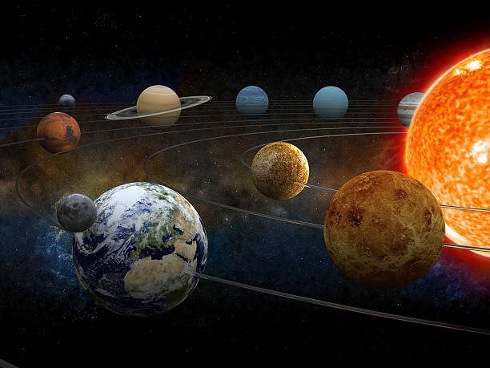

# Welcome to Our Planets Quiz game!
#### This game is made for the Code Institute third project. It is designed to play a quiz game about the Planets in our solar system! The quiz contains 8 questions with a, b or c answers. The user is asked to enter username and answer the questions and then the scores display and the user also gets the opportunity to print the top 5 scores to see if the result is in there. 

#### [Deployed site](https://planet-quiz-game.herokuapp.com/)
------

# Table of Contents
+ [Flowchart](#flowchart)
+ [Design](#design)
+ [Features](#features)
  + [Welcome section](#welcome-section)
  + [Questions](#questions)
  + [Displaying results](#displaying-results)
  + [Printing top 5 scores](#printing-top-5-scores)
+ [Testing](#testing)
+ [Validator testing](#validator-testing)
+ [Ufixed bugs](#unfixed-bugs)
  + [Solved issues](#solved-issues)  
+ [Deployment](#deployment)  
+ [Credits](#credits)  

-----

## Flowchart

#### Wireframes were made by using [Lucidchart](https://lucid.app/)
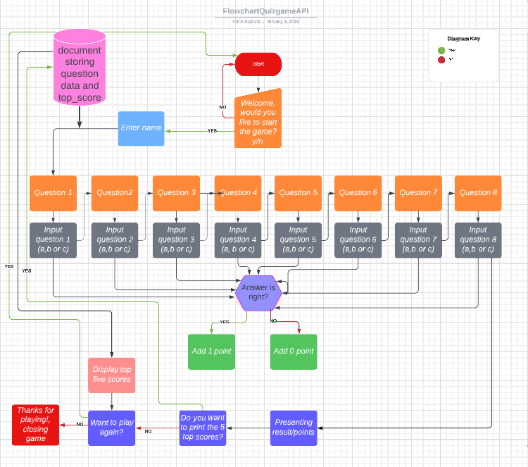

------
## Design

#### The game is designed with a simple terminal game design to make the game easy to play. The correct/wrong answers are displayed in green/red color to make that pop to the user. The yellow stars are used to pop on the black python window and also represent the theme of the quiz. As an extra feature the number of stars corresponding to the scores are also displayed toghether with the results at the end of the game in order to visualise the score. A background image with the planets was added to make the game more visiable appealing and also enhance the theme. 
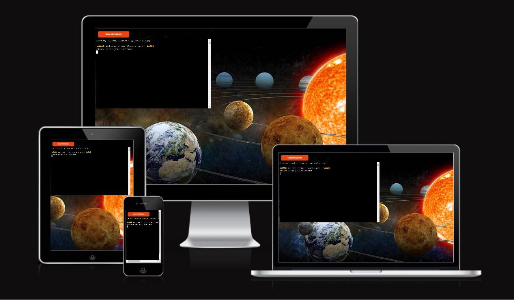
#### The background image was taken from [Istockphoto](https://www.istockphoto.com/en/photo/solar-system-gm482954331-13391001?phrase=solar%20system)

----

## Features

### Welcome section
#### When starting the game a welcome section is displayed, and the user is asked to enter their username (the username can not be an empty string, in that case an Invalid input message show and the user is asked to enter username again). 
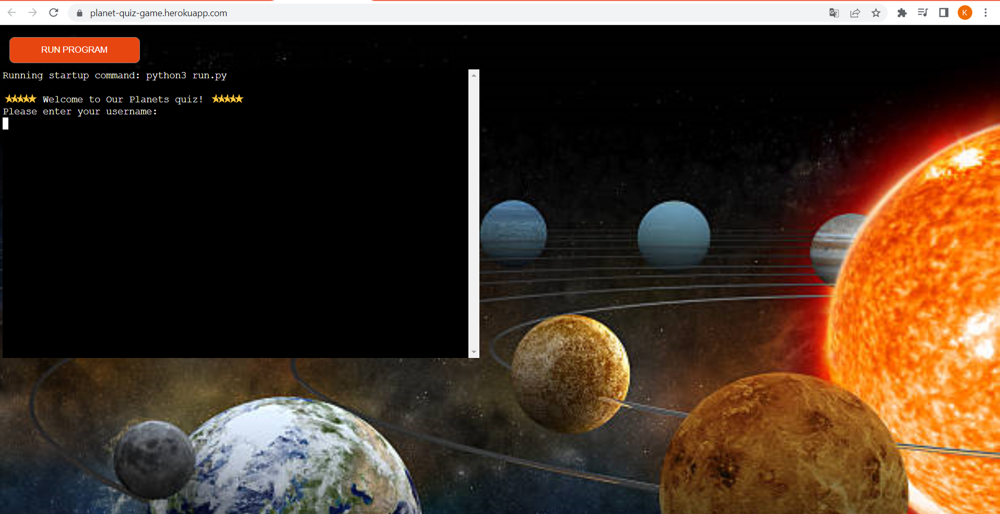
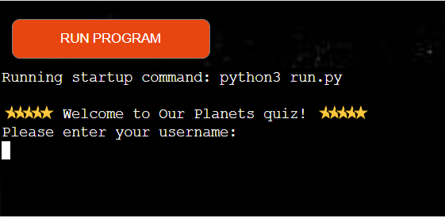
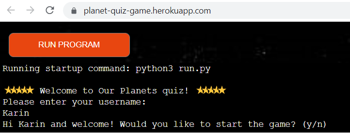
#### When username is entered a personal welcome message appear (the username is capitalized) and the user is asked the question "Do you want to start the game?, and must input y (yes) or no (n) (input is converted to lowercase so lower or uppercase both work but in case any other letter is entered an Invalid input message accure and the user is asked to enter y or n again). If the user enters no (n) a good bye message appear and the game is closed, but if the input is yes the game starts and the questions starts to display.
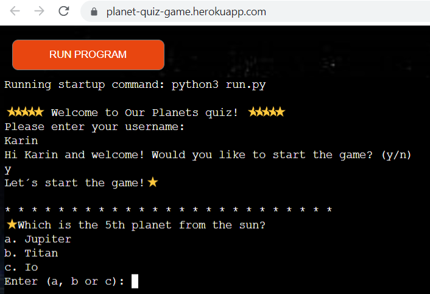

### Questions
#### When the game starts the questions are displayed and the user is provided with 3 choices and is asked to answer a, b or c (input is converted to lowercase so lower or uppercase both work but in case any other letter is entered an Invalid input message accure and the user is asked to enter a, b or c again). The questions and answers (as well as the scores) are stored in a google sheet. There are 14 questions in the google sheet but only 8 are displayed each game in order to alter the questions a bit and the questions are shuffled for each game and printed in random order for each game. This was a feature that felt important to make it more intreaguing to play another round. When the answer is entered correct or wrong is displayed (in green or red) to let the user see directly if the answer was correct or not. 
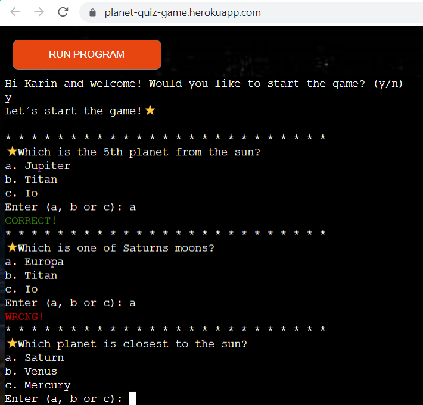

### Displaying results
#### When all 8 questions are answered the scores are displayed. First a row with the answered alternatives from the user, then a row with the correct alternatives, and finally the total score.
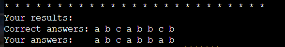 
#### Good job, you scored: x out of y (8) followed by number of stars according to the number of correct answers in order to make it more visiable for the user. This score (connected to the username) is then stored in the google sheet in the top_scores file.
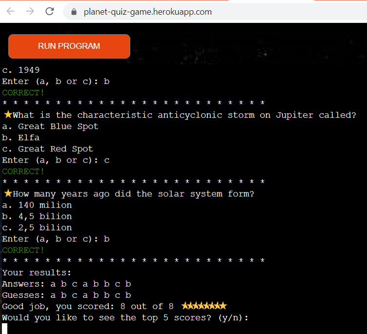

### Printing top 5 scores
#### When the scores have been displayed the user is asked if they want to print the top 5 scores. If the user enters no (n) the game is closed and the user is asked if they want to play again, but if the input is yes the top 5 scores are printed in two columns to let the user see if their result is in the top five scores. The user is then asked the question if they want to play again or not. If not, a good bye message appear and the game is closed. All inputs are checked for valid input.
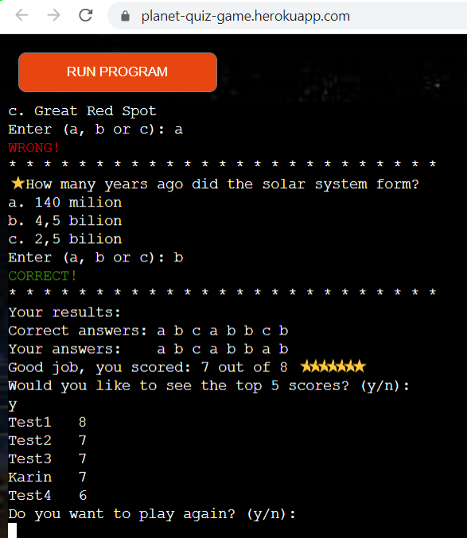

-------
## Testing

#### I tested that the site worked in different browsers: Google Chrome, Firefox, Edge

#### I confirmed that this projectfunctions on all standard screen sizes using the devtools device toolbar. The site has been tested on different physical devices: desktop, laptop, tablet and mobile.

#### I confirmed that the game is readable and easy to understand and all the game functions are working.

### Testing during development
* Tested that the data was gotten as expected from the google sheet "planets-quiz" by printing out data from the spreadsheet and also adding data from run.py to the spreadsheet. The data was added and printed as expected.

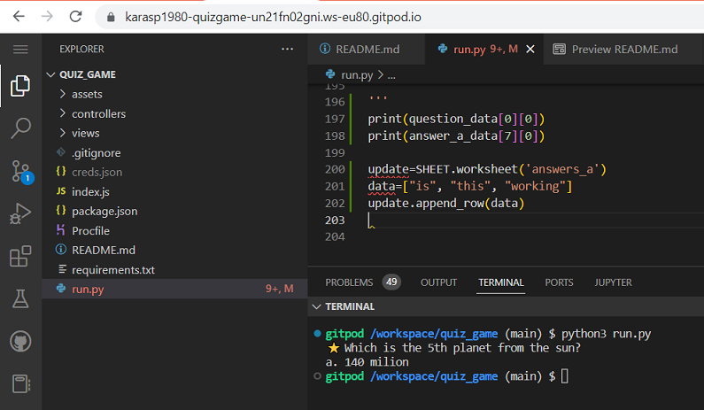
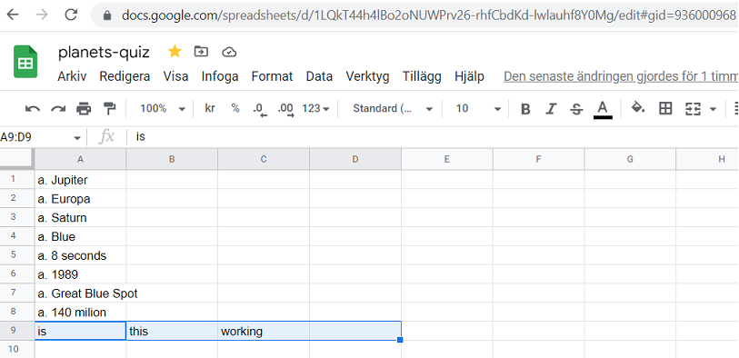

* Tested that the input is valid for all the inputs, otherwise ask the user to enter a valid input. The vaid input worked as expected.
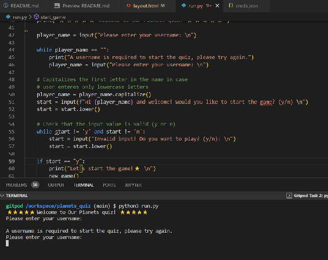
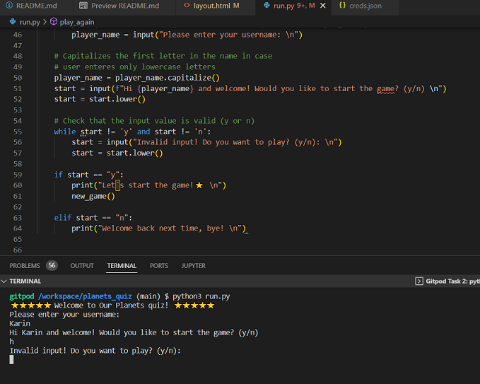
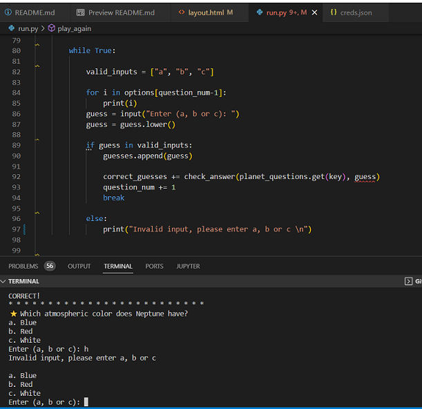
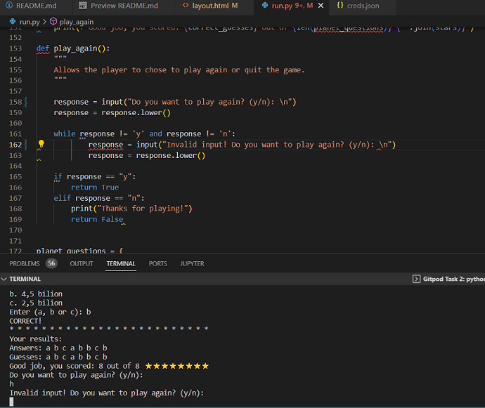

* Tested that the first input with the username is printed out capitalized and that all the inputs are changed to lowercase (in case the input is uppercase). Everything worked as expected, the username was capitalized eventhough lowercase was the input and the all other inputs were handled as lowercase even if uppercase was enterd.

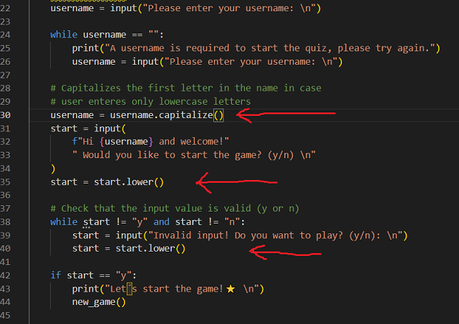
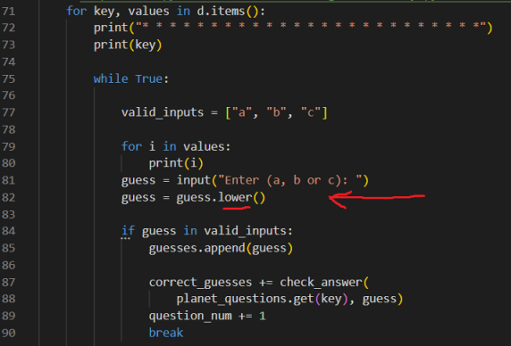
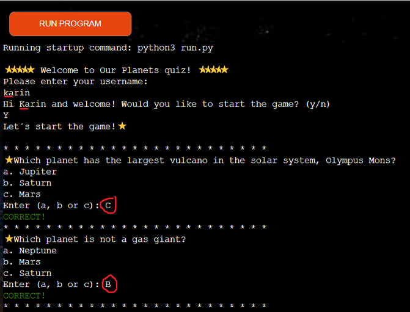
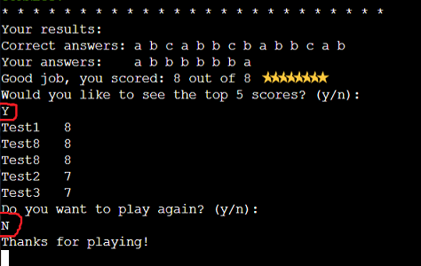

* Tested that the correct_guesses together with the username is added to the spreadsheet when a game is over and it was added correctly and as expected.
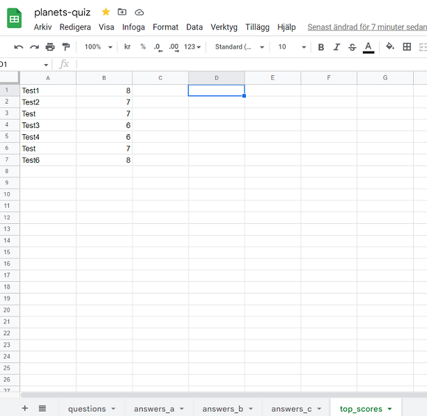

* Tested that the top 5 scores are printed correctly when entering yes on the quesition "Would you like to see the top 5 scores?and they were printed as expected in a nice column. Tested to first play a game with results that didn´t get in the top 5 scores and could see that it was not printed amongst the top scores. When playing a full score game which fitted in the top 5 scores it was printed in the top 5 scores as expected. Noticed that if the score is equal to a previous score, the old score is printed first in the list.

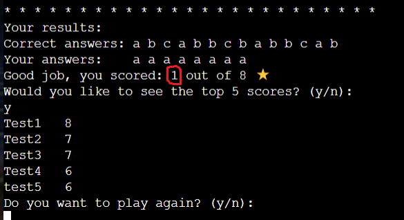
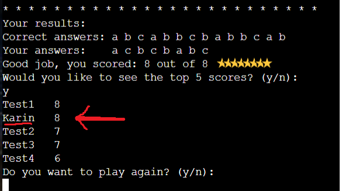

* Tested that the questions are shuffled for each new game, and that the options and answers are matched with the right questions + tested that only 8 of the 14 questions are printed each time, so the questions are altered. The test showed that the qustions were shuffled as expected and then only 8 of 14 questions are printed out (with the right options and results).

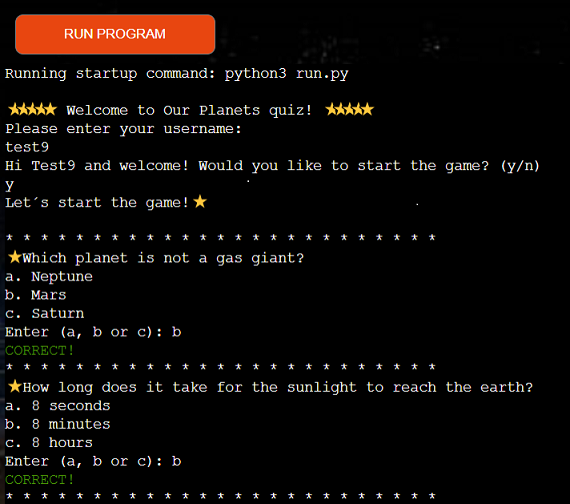
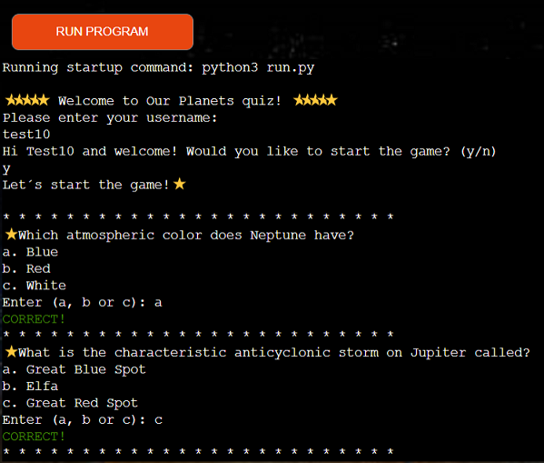
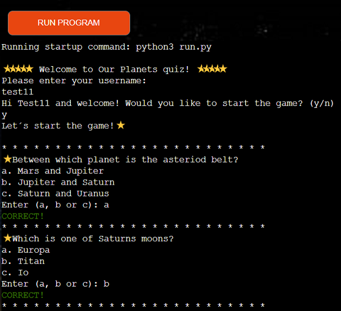

------

## Validator testing

### Python:
#### No errors were returned when passed through the Pep8 validator
[Pep8 validator](https://pep8ci.herokuapp.com/)
![Pep8 validator]/assets/images/CILinter.png)

-----

## Unfixed bugs

#### No unfixed bugs.
#### When printing the top 5 scores unfortunately the row might be altered a bit to the right if the username is too long, but I found no better way to print out and in most cases the username is not to long to fit.

## Solved issues
* When a game is over and the player gets the question "Do yo want to play again?" we want the game to restart and keep doing that as long as the player inputs yes (y) when asked the question. Therefore a while loop (with the condition while play_again() is True, call new_game() ) was added to the end of the new_game() function (after the scores have been displayed). But then the user got that question "Do yoy want to play again?" two times if answering no (n) to the question when having played more than one time. In order to fix that an if statement was used instead.
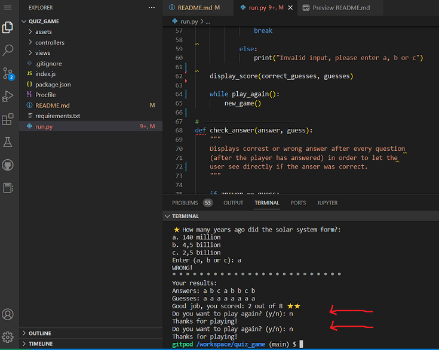

-----

## Deployment

#### This project was deployed to [Heroku](https://www.heroku.com/) using Code Institute's mock terminal.

   - Steps:

     - Go to Heroku and click on the new button at the top right of the page. Select create new app from the dropdown menu.

     - Enter a name, change region to Europe and click create app.

     - Go to settings and select Config Vars

     - Locate Buildpacks and add Python and NodeJS in that order.

     - Add a new Config Var with a keyword of PORT and a value of 8000

     - Exit settings and click Deploy. Select GitHub from the deploy options.

     - Select your repository and connect it to Heroku.

     - Click Enable Automatic Deploys in the automatic deploys section or make sure main branch is selected and click Deploy Branch in the manual deploy section.

     - The live version of the app can be found here [Deployed site](https://planet-quiz-game.herokuapp.com/)

-----

## Credits

#### Inspiration and help has come from the Code Institute projects [Love Sandwiches](https://github.com/Karasp1980/love_sandwiches).The answers of the questions has been checked using [Wikipedia](https://www.wikipedia.org) 

#### The following sites has also been helpful:
* [W3Schools](https://www.w3schools.com/) 
* [Bro Code](https://www.youtube.com/watch?v=yriw5Zh406s)  
* [Stackoverflow print 2D](https://stackoverflow.com/questions/13214809/pretty-print-2d-list/50257693#50257693)
* [CI Tom - Pub Quiz](https://github.com/CI-Tom/pub-quiz-challenge)
* [ANSI colors](https://gist.github.com/kamito/704813)
* [If__name__main](https://realpython.com/if-name-main-python/)
* [Realpython](https://realpython.com/iterate-through-dictionary-python/#iterating-through-items)
* [Stackoverflow shuffeling dictionary](https://stackoverflow.com/questions/19895028/randomly-shuffling-a-dictionary-in-python)